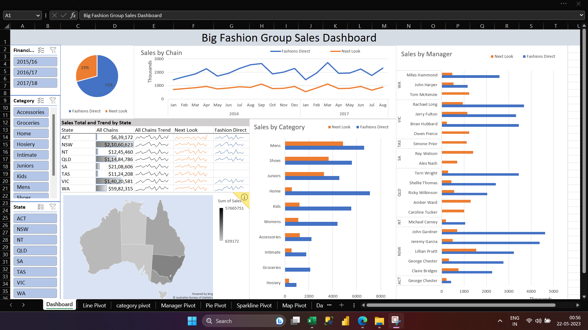
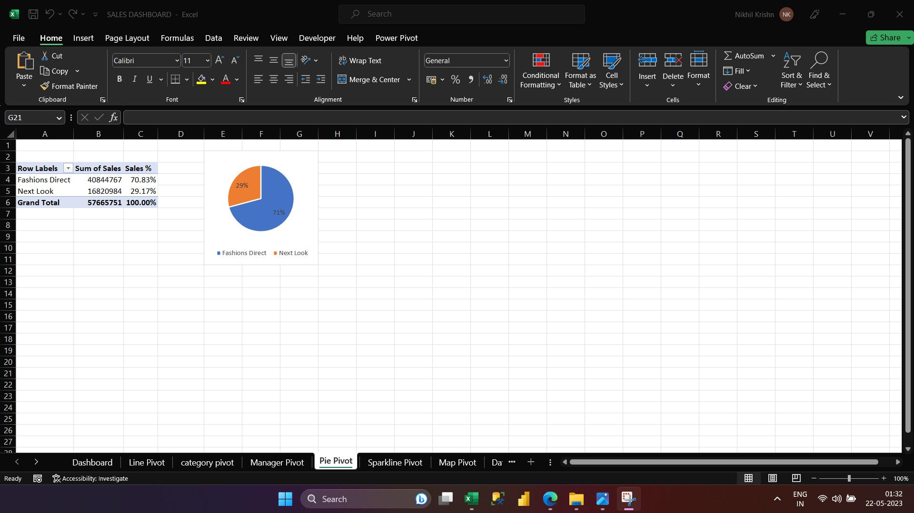
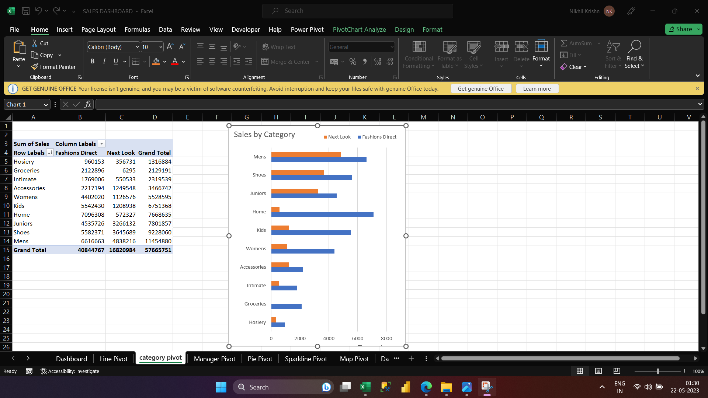
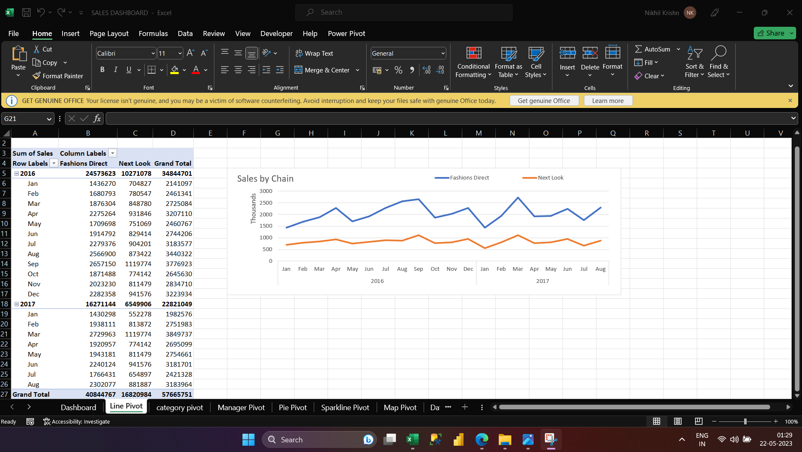
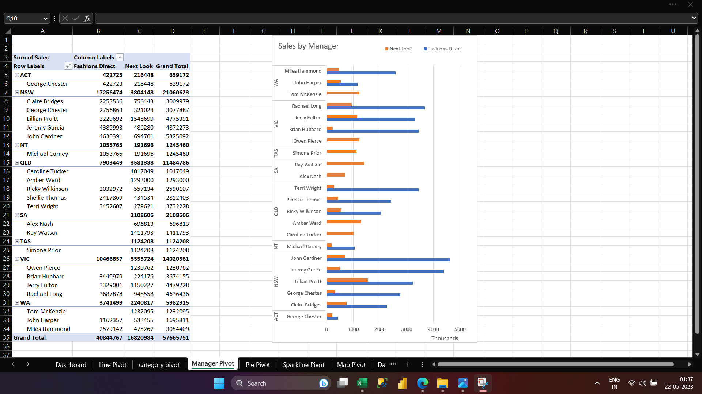

# BIG FASHION GROUP SALES DASHBOARD:
## Project Overview:
Used Excel to create a Big Fashion Group sales dashboard to track the company's sales performance and provide insights.
### Final Dashboard:

### Objectives:
##### •	Created data visualization tools to monitor sales activity ,sales by category and suggested improvement strategies.

##### •	Developed criteria to assist with sorting and filtering relevant data.
##### •	Monitor sales activity and analyzed sales trends to project potential increases and decreases in sales activity.

##### •	Utilized data analysis to improve the accuracy and timeliness of reporting.
##### •	Enhanced management’s ability to make informed decisions on sales processes.

##### •	Optimized the user experience by creating interactive dashboards with intuitive navigation.
##### •	Designed and built user-friendly dashboards with interactive features to glean actionable insights.
